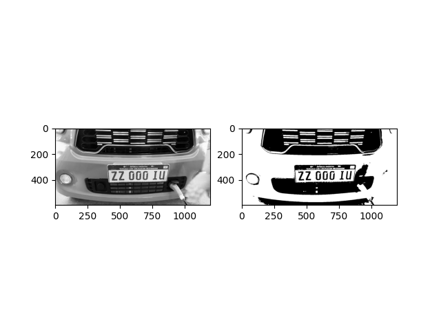
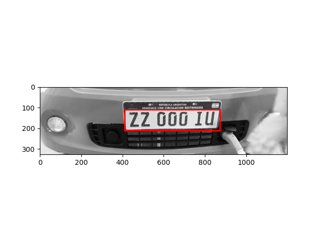
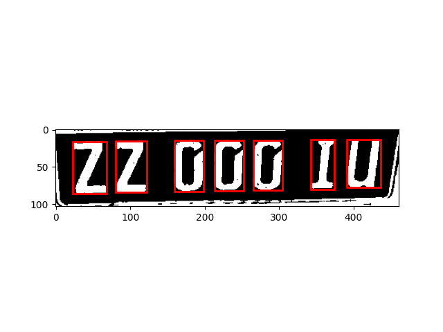

# LP_reader
This is an Argentinian License Plate reader implemented in python using concepts like Machine Learning, Vertical and Horizontal Projection and Connected Components Analysis.

# Installation

First you have to install the required libraries with this command (the pre-requirement is to have installed python3 and pip3):

```
pip3 install -r requirements.txt
```
# Creating the text recognition model

Previous to executing the program you need to create and train a text recognition model used to identify the characters of the license plates. To do this you need to use a dataset with images of the characters, you can find it here https://github.com/santiparis/ALP.git. It is convenient to install the dataset inside the project directory, if you choose not to do it this way you must change the training data path in the **machine_training.py** script.

Now you can create and train the model! (it will be saved in **models** directory)

```
python3 machine_training.py
```
# Running the script

Everything ready! Now you can run the script with this command:

```
python3 prediction.py
```

Take to consideration this will create 3 new pictures based on the **car.jpg** in the project directory (a sample image is included in the repository). You can use the image you want (it does not work very well for images with complex patterns or great contrast differences WIP).

You should get results like this:

The first picture generated is **gray_scale_vs_binary.png**. It shows the result of applying a gray scale filter of the image (left) and then the binarization of this result:



The second picture, **potential_regions.png**, shows the result of cropping the binary image to the portion of it that more likely has the plate through Vertical and Horizontal Projection analysis. Then, using Connected Components Analysis, all the regions that have similar dimensions to a license plate are marked with a red rectangle (in the best case only the license plate should be marked this way):



The last image (**plate.png**) shows the segmentation of the characters of the plate:



Finally, the program outputs the model prediction for the plate:

```
(594, 1200)
[array(['I'], dtype='<U1'), array(['U'], dtype='<U1'), array(['0'], dtype='<U1'), array(['0'], dtype='<U1'), array(['0'], dtype='<U1'), array(['Z'], dtype='<U1'), array(['Z'], dtype='<U1')]
IU000ZZ
ZZ000IU
```
This represents the shape of the original picture, the array of characters in the plate, the prediction of the model, and lastly the **ordered** prediction of the model (if everything went well you should get the license plate number!)

# To improve

* A **makefile** will be implemented to automate the model creation and training
* License plate detection needs to be improved and fine-tuned.
* The image to be analyzed will be passed as an argument.
* Configuration files must be implemented.
* The output will be more user-friendly.